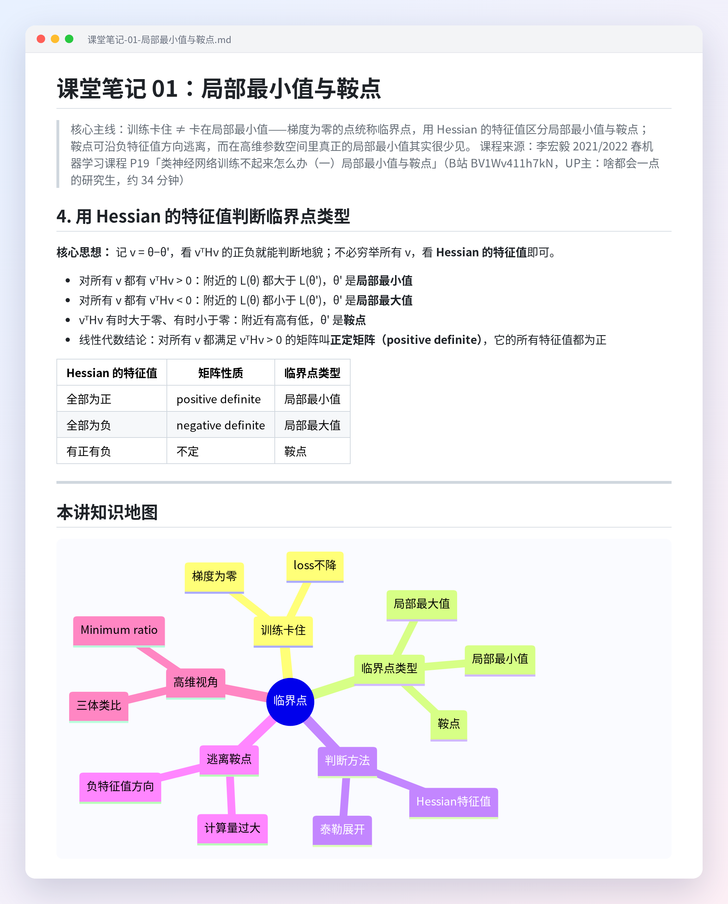

<div align="center">

# bilibili-douyin-notes

**An AI Agent Skill that turns Bilibili / Douyin videos into structured Markdown lecture notes**

Subtitle fetching · Local speech recognition · Key-frame screenshots · Note template — works without login; scan-to-login unlocks AI subtitles

[](https://github.com/lucky-Luor/bilibili-douyin-notes/actions/workflows/ci.yml)
[](LICENSE)
[]()
[-orange.svg)]()

[简体中文](README.md) | English

</div>

> 💬 Just tell your AI agent "make lecture notes from this video: <Bilibili / Douyin link>" and you get notes like this 👇
> (Full example: [Hung-yi Lee ML course · Local Minima & Saddle Points](examples/课堂笔记-01-局部最小值与鞍点.md), in Chinese)

<p align="center"></p>

---

## ✨ Features

- **Two platforms**: Bilibili (`bilibili.com` / `b23.tv` short links / BV IDs) and Douyin (`douyin.com` / `v.douyin.com` / `iesdouyin.com` links / share text)
- **Subtitles first**: fetches official / AI subtitles from Bilibili (login optional) — instant transcripts at zero cost
- **Local ASR fallback**: when no subtitles exist, transcribes locally with faster-whisper (CPU int8; uses the hf-mirror inside mainland China). **No paid API calls**
- **Key-frame screenshots**: anchored on transcript timestamps and extracted with PyAV; a local quality check flags black / blank / blurry frames (white-background slides are not misjudged), and the agent makes the final visual call
- **Douyin without login**: downloads watermark-free videos as a guest (ttwid + a_bogus signature), no account cookie needed
- **Lecture-note template**: sections, bolded key terms, real code references, a mind map, concept cards, self-test questions, and a collapsible video time index with deep links back to the video

## 🧩 Workflow

```
Video link (Bilibili / Douyin)
        │
        ▼
 Step 1  Fetch metadata + subtitles (Bilibili) / download video (Douyin)
        │
        ├── subtitles found ──► use them directly
        └── no subtitles ─────► Step 2  local faster-whisper ASR
        │
        ▼
 Step 2.5 (optional)  key-frame screenshots (PyAV)
        │
        ▼
 Step 3  AI writes the notes from the template → validated by a quality gate
```

## ⚡ Quick Start

```bash
# One-line install (Claude Code; for other agents, use their skills directory)
git clone https://github.com/lucky-Luor/bilibili-douyin-notes.git ~/.claude/skills/bilibili-douyin-notes && pip install -r ~/.claude/skills/bilibili-douyin-notes/requirements.txt
```

Then just ask your agent: **"Make lecture notes from this video: https://www.bilibili.com/video/BVxxxx"**.

## 📦 Installation

This skill follows the **Agent Skills spec** (`SKILL.md`) and works with any compatible AI agent. Supported locations:

- `~/.claude/skills/` — Claude Code
- `~/.zcode/skills/` — ZCode
- `~/.agents/skills/` — shared skills path for Codex and other agents

```bash
# 1. Clone into your agent's skills directory
git clone https://github.com/lucky-Luor/bilibili-douyin-notes.git ~/.claude/skills/bilibili-douyin-notes

# 2. Install Python dependencies
pip install -r requirements.txt

# 3. (Optional) Log in to Bilibili by QR code to get AI subtitles
python scripts/bili_fetch.py --login
```

| Component | Purpose | Required? |
|---|---|---|
| `faster-whisper` | ASR fallback | For videos without subtitles |
| `av` (PyAV) | Audio decoding / frame extraction | Same as above |
| `gmssl` | Douyin a_bogus signature (SM3) | Douyin links only |
| `numpy` / `pillow` | Screenshot quality check | Screenshot step only |

## ⚙️ Configuration

Copy `config.example.json` to `config.json` in the same directory. `SESSDATA` (Bilibili login cookie) is optional and is filled in automatically by `--login`. `config.json` is git-ignored — never share it.

ASR tuning: `asr_model` (tiny ~ large-v3, falls back one size automatically on failure), `asr_device` (auto / cpu / cuda, falls back to cpu), `asr_cpu_threads` (0 = auto).

## 🚀 Usage

Talk to your agent:

> Make lecture notes from this video: https://www.bilibili.com/video/BVxxxx
>
> Summarize this Douyin video: https://v.douyin.com/xxxx/

Or run the scripts by hand (see [SKILL.md](SKILL.md) for details):

```bash
python scripts/bili_fetch.py --probe "<url>"                 # metadata only
python scripts/bili_fetch.py "<url>" "<outdir>"              # Bilibili: metadata + subtitles
python scripts/douyin_fetch.py "<url or share text>" "<outdir>"  # Douyin: metadata + video
python scripts/bili_transcribe.py "<outdir>/metadata.json"  # local ASR when no subtitles
python scripts/note_nav.py "<note.md>" --meta "<outdir>/metadata.json" --txt-dir "<outdir>"       # fill deep links
python scripts/validate_note.py "<note.md>" --meta "<outdir>/metadata.json" --txt-dir "<outdir>"  # quality gate
```

## ❓ FAQ

<details>
<summary><b>What do I need?</b></summary>

Python 3.10+ and any AI agent that supports the Agent Skills (`SKILL.md`) spec, such as Claude Code, Codex or ZCode. No GPU and no paid API required.
</details>

<details>
<summary><b>Do I have to log in to Bilibili?</b></summary>

No. Official CC subtitles work without login, and local ASR kicks in when there are none. Logging in by QR code unlocks Bilibili AI subtitles, which lets most videos skip ASR entirely. Douyin needs no login at all.
</details>

<details>
<summary><b>ASR is too slow?</b></summary>

Use a smaller `asr_model` (e.g. `small` / `base`) in `config.json`, or set `asr_device: "cuda"` if you have an NVIDIA GPU. You can also transcribe a single part first (`--page 1`) to estimate the time.
</details>

<details>
<summary><b>Does it work for English videos?</b></summary>

Yes — faster-whisper is multilingual. Note that the note template and examples are written in Chinese, so ask your agent explicitly if you want the notes in English.
</details>

## ⚠️ Known Limitations

- Local transcription of long videos (>1 h) on CPU takes roughly 1–3× the video length; faster than real time with an NVIDIA GPU
- ASR may garble technical terms — use `scripts/apply_glossary.py` to correct them
- Douyin depends on the platform's signature algorithm and may break temporarily when the platform updates (detail API returns 403)
- Only publicly accessible videos are supported

## 📄 License

[MIT](LICENSE). **Exception:** `scripts/abogus.py` (Douyin signature, GPLv3) is **not** included in this repository; `scripts/ensure_abogus.py` downloads it from a pinned upstream commit with SHA-256 verification on first use. See the [Chinese README](README.md#-许可证) for details.

## 🙏 Acknowledgements

[JoeanAmier/TikTokDownloader](https://github.com/JoeanAmier/TikTokDownloader) · [Evil0ctal/Douyin_TikTok_Download_API](https://github.com/Evil0ctal/Douyin_TikTok_Download_API) · [JefferyHcool/BiliNote](https://github.com/JefferyHcool/BiliNote) · [faster-whisper](https://github.com/SYSTRAN/faster-whisper)

<div align="center">

**If this skill saves you note-taking time, a ⭐ Star would mean a lot!**

Got notes you're happy with? Share them in [Issues](https://github.com/lucky-Luor/bilibili-douyin-notes/issues) — bug reports and ideas are welcome too 🙌

</div>
