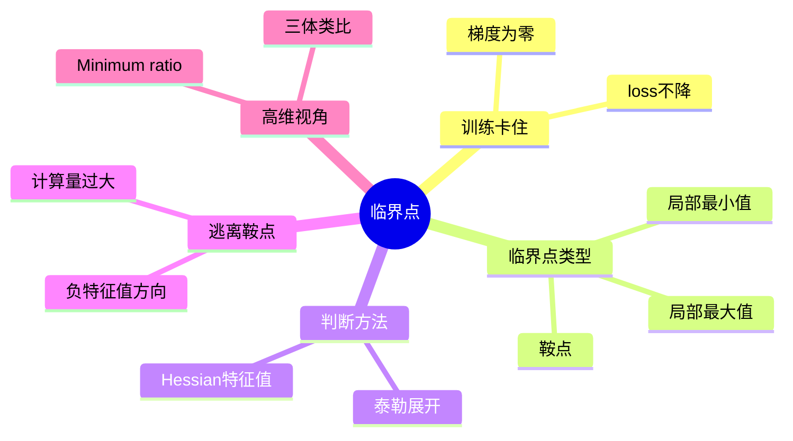

# 课堂笔记 01：局部最小值与鞍点

> 核心主线：训练卡住 ≠ 卡在局部最小值——梯度为零的点统称临界点，用 Hessian 的特征值区分局部最小值与鞍点；鞍点可沿负特征值方向逃离，而在高维参数空间里真正的局部最小值其实很少见。
> 课程来源：李宏毅 2021/2022 春机器学习课程 P19「类神经网络训练不起来怎么办（一）局部最小值与鞍点」（B站 BV1Wv411h7kN，UP主：啥都会一点的研究生，约 34 分钟）

## 目录

- [1. 为什么 Optimization 会失败](#1-为什么-optimization-会失败)
- [2. 临界点：局部最小值与鞍点](#2-临界点局部最小值与鞍点)
- [3. 用泰勒展开描述临界点附近的地貌](#3-用泰勒展开描述临界点附近的地貌)
- [4. 用 Hessian 的特征值判断临界点类型](#4-用-hessian-的特征值判断临界点类型)
- [5. 实例：史上最废的两参数网络](#5-实例史上最废的两参数网络)
- [6. 沿特征向量方向逃离鞍点](#6-沿特征向量方向逃离鞍点)
- [7. 高维视角：局部最小值其实并不常见](#7-高维视角局部最小值其实并不常见)
- [本讲知识地图](#本讲知识地图)
- [概念卡片](#概念卡片)
- [自测题（复习用）](#自测题复习用)
- [视频时间索引](#视频时间索引)

---

## 1. 为什么 Optimization 会失败

**核心思想：** 训练 loss 降不下去，常见猜想是参数走到了**梯度为零**的地方，gradient descent 因此停止更新。

- 本讲只讨论 **Optimization**（怎么把 gradient descent 做好），与 Overfitting 无关
- 典型症状一：参数不断更新，**training loss** 不再下降，但数值仍不令人满意；比如深层网络并不比线性模型或浅层网络做得更好
- 典型症状二：模型一开始就"撑不起来"，无论怎么更新参数 loss 都掉不下去
- 当参数对 loss 的微分为零时，gradient descent 无法再更新参数，训练随之停止

---

## 2. 临界点：局部最小值与鞍点

**核心思想：** 梯度为零的点不只有局部最小值，还有鞍点，两者统称**临界点（critical point）**。

- 很多人习惯说"卡在 **local minima**"，但写论文时这样说会显得不专业——梯度为零的点不止这一种
- **鞍点（saddle point）**：梯度为零，但既不是局部最小值也不是局部最大值；在某个方向上较高、另一个方向上较低，形如马鞍
- 训练停下时只能说"卡在了 **critical point**"，不能断言卡在局部最小值
- 区分两者很有意义：

| 卡在哪里 | 周围地形 | 还有没有路走 |
|---|---|---|
| 局部最小值 | 四周都比当前点高 | 没有路可走，往任何方向 loss 都会上升 |
| 鞍点 | 有些方向高、有些方向低 | 有路可走，逃离鞍点 loss 还能继续下降 |

---

## 3. 用泰勒展开描述临界点附近的地貌

**核心思想：** 整个 loss function 写不出来，但在给定参数 θ' **附近**可以用**泰勒级数近似**表示。

- 第一项 L(θ')：θ 与 θ' 很接近时，L(θ) 与 L(θ') 也很接近
- 第二项 (θ−θ')ᵀg：**g 是梯度**（一次微分），第 i 个分量是 L 对 θ 第 i 个分量的偏微分，用来弥补两点之间的差距
- 第三项 ½(θ−θ')ᵀH(θ−θ')：**H 是 Hessian 矩阵**，第 i 行第 j 列是 L 对 θᵢ、θⱼ 的二次微分，进一步补足剩余差距
- 走到临界点时 g 是零向量，第二项消失，**θ' 附近的地貌只由 Hessian 这一项决定**

```text
L(θ) ≈ L(θ') + (θ−θ')ᵀ g + ½ (θ−θ')ᵀ H (θ−θ')

临界点处 g = 0：
L(θ) ≈ L(θ') + ½ (θ−θ')ᵀ H (θ−θ')
```

---

## 4. 用 Hessian 的特征值判断临界点类型

**核心思想：** 记 v = θ−θ'，看 vᵀHv 的正负就能判断地貌；不必穷举所有 v，看 **Hessian 的特征值**即可。

- 对所有 v 都有 vᵀHv > 0：附近的 L(θ) 都大于 L(θ')，θ' 是**局部最小值**
- 对所有 v 都有 vᵀHv < 0：附近的 L(θ) 都小于 L(θ')，θ' 是**局部最大值**
- vᵀHv 有时大于零、有时小于零：附近有高有低，θ' 是**鞍点**
- 线性代数结论：对所有 v 都满足 vᵀHv > 0 的矩阵叫**正定矩阵（positive definite）**，它的所有特征值都为正

| Hessian 的特征值 | 矩阵性质 | 临界点类型 |
|---|---|---|
| 全部为正 | positive definite | 局部最小值 |
| 全部为负 | negative definite | 局部最大值 |
| 有正有负 | 不定 | 鞍点 |

---

## 5. 实例：史上最废的两参数网络

**核心思想：** 用只有 w₁、w₂ 两个参数的网络亲手算一遍 Hessian，验证原点是鞍点。

- 网络 y = w₁·w₂·x，没有激活函数，也没有 bias；训练数据只有一笔：x = 1，标签 ŷ = 1
- 损失函数为 L = (1 − w₁w₂)²；参数只有两个，可以穷举画出 **error surface**
- 从图上看：**原点**是鞍点，两条"山沟"里排着一排局部最小值
- 不穷举也能判断：w₁ = w₂ = 0 时梯度为零，原点是临界点；代入得 Hessian，算出特征值 **2 与 −2**，有正有负，所以是鞍点

```python
# 按视频讲解还原：在原点 (w1, w2) = (0, 0) 处判断临界点类型
import numpy as np

H = np.array([[0, -2],
              [-2, 0]])        # L = (1 - w1*w2)^2 在原点的 Hessian
eigvals, eigvecs = np.linalg.eigh(H)
print(eigvals)                  # [-2.  2.] → 有正有负 → 鞍点
```

---

## 6. 沿特征向量方向逃离鞍点

**核心思想：** 在鞍点处梯度失效，但 Hessian 的**负特征值对应的特征向量**能指出让 loss 下降的方向。

- 设 u 是 H 的特征向量、λ 是对应特征值，则 uᵀHu = λ‖u‖²
- 若 λ < 0，令 θ = θ' + u，第三项为负，得到 L(θ) < L(θ')，即沿 u 方向更新可以降低 loss
- 在上面的例子里，λ = −2 对应特征向量 [1, 1]，沿这个方向更新参数就能离开原点处的鞍点
- 实际训练中**几乎不会真的计算 Hessian**：二次微分和特征分解的运算量太大，有其他代价更低的逃离方法（视频中未展开，建议补充）
- 讲这个方法是想说明：卡在鞍点并不可怕，最坏情况下也有办法找到方向

---

## 7. 高维视角：局部最小值其实并不常见

**核心思想：** 低维空间里看似走投无路的局部最小值，到了高维空间可能只是一个鞍点。

- 课堂上用《三体》里的故事做类比：三维空间中封闭的石棺，在四维空间里是有路可以进去的
- 一维 error surface 上到处像局部最小值，到了二维可能只是鞍点；网络参数动辄百万、千万，error surface 的维度同样这么高，**可走的路很可能非常多**
- **Minimum ratio** = 正特征值个数 ÷ 特征值总数；所有特征值都为正时才是真正的局部最小值
- 实验观察：把训练到梯度很小的网络拿出来分析，minimum ratio 最大也只有约 0.5～0.6，几乎找不到所有特征值都为正的临界点
- 结论：训练停下来**多半是卡在鞍点**，而不是局部最小值；下一讲讨论具体的解决方法

---

## 本讲知识地图



## 概念卡片

### 临界点

- 定义：梯度为零的点的统称，包括局部最小值、局部最大值和鞍点
- 出现：1、2、4
- 依赖：
- 易混：局部最小值——局部最小值只是临界点的一种，训练停住不等于卡在局部最小值

### 鞍点

- 定义：梯度为零，但某些方向较高、某些方向较低的点，Hessian 特征值有正有负
- 出现：2、4、5、6、7
- 依赖：临界点，Hessian
- 易混：局部最小值——鞍点周围仍有让 loss 下降的方向

### 局部最小值

- 定义：附近所有方向的 loss 都比它高的临界点，Hessian 特征值全部为正
- 出现：2、4、7
- 依赖：临界点，Hessian
- 易混：鞍点——局部最小值四周都没有下降路径

### Hessian

- 定义：由 loss 对参数二次微分组成的矩阵，在临界点处决定附近的地貌
- 出现：3、4、5、6
- 依赖：泰勒级数近似
- 易混：Minimum ratio——Hessian 是矩阵本身，Minimum ratio 是由其特征值算出的比例

### 泰勒级数近似

- 定义：在参数 θ' 附近，用 L(θ')、梯度项和 Hessian 项来近似 loss function
- 出现：3、4
- 依赖：
- 易混：Hessian——泰勒展开是描述框架，Hessian 只是其中的二次项

### Minimum ratio

- 定义：正特征值个数占全部特征值个数的比例，用来衡量临界点有多像局部最小值
- 出现：4、7
- 依赖：Hessian
- 易混：局部最小值——只有比值为 1 才是真正的局部最小值

## 自测题（复习用）

1. 训练时 loss 不再下降，为什么不能直接说"卡在了局部最小值"？（对应：临界点）
<details><summary>答案</summary>

**答案：** 梯度为零的点统称临界点，除局部最小值外还可能是鞍点，只能说卡在临界点。

</details>

2. 在临界点处，泰勒展开中的哪一项决定了附近的地貌？为什么？（对应：泰勒级数近似）
<details><summary>答案</summary>

**答案：** 由 Hessian 二次项决定，因为临界点处梯度为零，一次项消失。

</details>

3. 如何通过 Hessian 判断一个临界点是局部最小值、局部最大值还是鞍点？（对应：Hessian）
<details><summary>答案</summary>

**答案：** 特征值全正为局部最小值，全负为局部最大值，有正有负为鞍点。

</details>

4. 对于 L = (1 − w₁w₂)²，原点的 Hessian 特征值是多少？由此能得出什么结论？（对应：鞍点）
<details><summary>答案</summary>

**答案：** 特征值为 2 和 −2，有正有负，所以原点是鞍点。

</details>

5. 卡在鞍点时，Hessian 怎样告诉我们参数的更新方向？实际训练中为什么很少这么做？（对应：鞍点）
<details><summary>答案</summary>

**答案：** 沿负特征值对应的特征向量更新可以降低 loss；但计算 Hessian 及其特征分解的代价太大，所以很少使用。

</details>

6. Minimum ratio 是怎么定义的？实验中它的取值说明了什么？（对应：Minimum ratio）
<details><summary>答案</summary>

**答案：** 正特征值个数除以特征值总数；实验中最大约 0.5～0.6，说明真正的局部最小值很少，训练多半卡在鞍点。

</details>

---

<!-- NAV:BEGIN 条目由模型写出，深链由 scripts/note_nav.py 填充 -->
## 视频时间索引

<details>
<summary>📺 需要回看原片时展开</summary>

- [00:30](https://www.bilibili.com/video/BV1Wv411h7kN?p=19&t=26) 1. 为什么 Optimization 会失败
- [01:41](https://www.bilibili.com/video/BV1Wv411h7kN?p=19&t=97) 2. 临界点：局部最小值与鞍点
- [04:16](https://www.bilibili.com/video/BV1Wv411h7kN?p=19&t=252) 3. 用泰勒展开描述临界点附近的地貌
- [09:16](https://www.bilibili.com/video/BV1Wv411h7kN?p=19&t=553) 4. 用 Hessian 的特征值判断临界点类型
- [13:36](https://www.bilibili.com/video/BV1Wv411h7kN?p=19&t=811) 5. 实例：史上最废的两参数网络
- [19:33](https://www.bilibili.com/video/BV1Wv411h7kN?p=19&t=1170) 6. 沿特征向量方向逃离鞍点
- [25:34](https://www.bilibili.com/video/BV1Wv411h7kN?p=19&t=1529) 7. 高维视角：局部最小值其实并不常见

</details>

<!-- NAV:END -->
