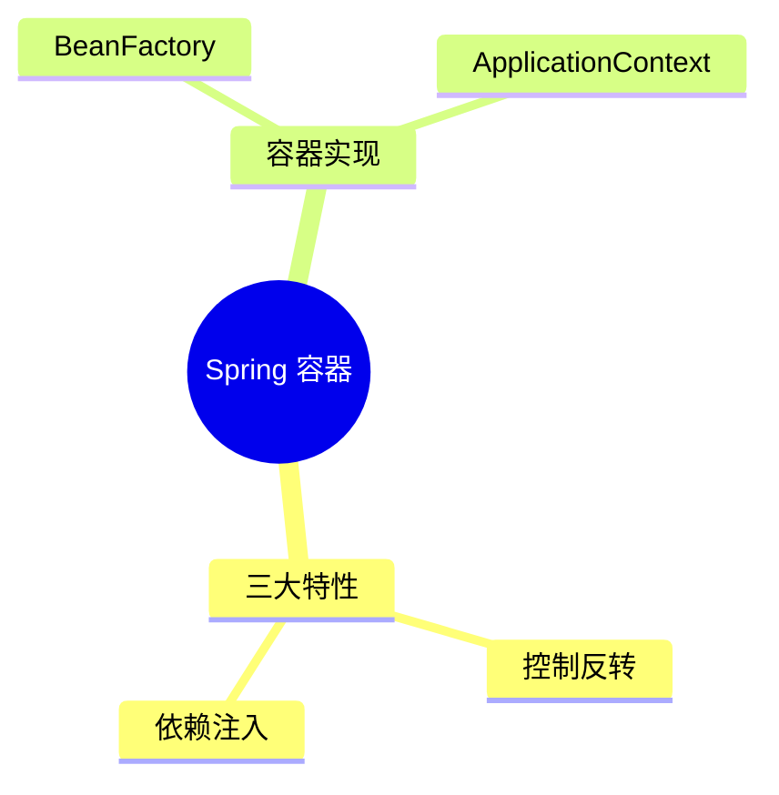
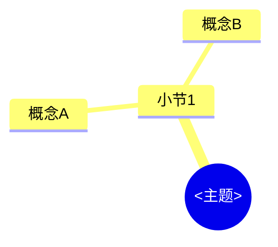

# 课堂笔记模板与规范（bilibili-douyin-notes）

**版本：v2**（笔记 frontmatter 的 `template_version` 字段取此值）

> **v1 冻结说明**：v1（★ 符号体系）自本版起冻结、不再演进，但仍继续支持——质量门禁
> `scripts/validate_note.py` 按笔记 frontmatter 的 `template_version` 字段分派规则：
> 写 `v2` 走本规范，缺失或写 `v1` 走旧 ★ 规则。既有 v1 笔记零改动继续可校验；
> **新笔记一律按本文件（v2，三词文字标签）生成**，v2 不再接受 ★ 符号。

本文件是本 skill 生成课堂笔记的**唯一模板与规范**，包含：完整 Markdown 骨架
（lecture / short 两型）、语法契约（标注行 / 概念卡片 / 自测题 / 知识地图）、
证据锚点规范、short 差异表、截图嵌入规范、生成流程、模板要点清单。
不依赖任何个人本机文件，任何人在任何机器上按本文件生成都应得到结构一致的笔记。

---

## 一、frontmatter（笔记第一个块，`---` 包围，全部字段必填）

```markdown
---
template_version: v2
note_type: lecture            # lecture（讲座/课程）| short（短视频）
platform: bilibili            # bilibili | douyin
bvid: BV1xxxxxxxxx            # 抖音平台此字段填 video_id
source: https://www.bilibili.com/video/BV1xxxxxxxxx
created: 2026-10-03
duration: "42:10"
---
```

- `note_type` 取 metadata.json 顶层 `suggested_note_type`（由 bili_fetch.py /
  douyin_fetch.py 按总时长与分P数给出）；技术密度高的短片值得 lecture，Agent 可在
  frontmatter 覆盖建议值，门禁只读 frontmatter。
- `duration` 是带引号的 `"mm:ss"` 字符串。
- `source` 为原视频链接（B站含 BV 号；抖音为视频页链接）。

## 二、重点分级：三词文字标签（封闭词表，禁止变体）

| 标签 | 语义（沿用 v1 ★ 三级语义） | 判定标准 |
|---|---|---|
| **核心必考** | 核心概念 / 必考点（原 ★★★） | 本讲主线；合上笔记能独立复述才合格 |
| **重点掌握** | 重要机制 / 易混淆点（原 ★★） | 与相邻概念有区别或常被误解 |
| **了解即可** | 补充了解（原 ★） | 延伸知识、工具细节，考试不考但值得知道 |

标注行固定格式（标签加粗、后接一个空格、再接非空要点句；行尾 `[mm:ss]` 锚点可选，复习场景默认不写）：

```markdown
- **核心必考** 要点句 [mm:ss]
- **重点掌握** 要点句 [mm:ss]
- **了解即可** 要点句
```

规则（对应门禁）：

- 标签词**必须严格是三词白名单之一**——`**必考**`、`**核心考点**`、`**必须掌握**`
  等任何变体都是格式非法（error）；
- 要点句必须是"完整可复述"的句子，不是关键词罗列；缺失要点句为 error；
- 每讲（整篇笔记）**至少 1 条** `核心必考`（error）；
- `核心必考` 占标注行总数 **≤ 1/3**（lecture 为 warning；short 豁免）——
  防"全是重点=没有重点"，但不再设"每讲 2~4 个"之类的数量窗口；
- 每个标签为 `核心必考` 的**概念卡片**必须被至少一道自测题覆盖（`（对应：…）`，见 5.4）；
- 标注行统计**只作用于听讲层**：从文件头到 `## 概念卡片` 标题之前（无概念卡片章节
  则到 `## 自测题` 之前），并跳过所有代码块；概念卡 `### 概念名（标签）` 标题不进入统计。

## 三、证据锚点规范（可选装饰）

**定位（2026-10-04 修订）：本 skill 的笔记是"看完课替代手写笔记"的复习资料，
读者不需要拿笔记跳回视频**——视频时间戳降为可选装饰，默认少用（每小节至多
一两处关键处），不为凑覆盖率硬加。防虚构规则仍然生效：

1. （可选）某条论断确需回溯时，用行内 `[mm:ss]` 标注，如
   `……这一设计解决了 X 问题 [05:43]`；标注行的 `[mm:ss]` 同样可选。
2. **时间戳必须来自转写稿/字幕里真实存在的 `[mm:ss]` 时间行**，禁止编造。
   生成笔记前先在转写稿里确认该时间行存在（grep 即可）。转写稿时间是"该段话开始的
   时刻"，ASR 相对画面约有 1~3 秒滞后，**引用时允许小幅前移**——门禁按总秒数做
   ±5 秒容差校验（可跨分钟，`[08:02]` 与转写稿 `[07:59]` 判近）；但**不得虚构**
   转写稿中不存在的时刻。
3. 分钟位允许 1~3 位（`[123:45]` 合法，容忍超长讲座）。
4. 代码示例必须标注来源，二选一：
   - 来自视频：`来源：P06 [12:34]`（哪个分P、哪个时刻）；
   - 来自克隆的代码仓库：`来源：仓库 simplejava/src/main/java/demo/OrderService.java`
     （子项目 + 文件路径）。
   来源标注检查**仅对代码语言白名单生效**（java/python/js/ts/c/cpp/xml/sql/
   properties/yaml/json/bash/shell/html/css 等）；`mermaid`、`text`、`console`、
   `output`、`diff` 等非代码块不检查来源（但仍须正确闭合 fence）。
5. 转写稿/字幕里没有的内容不要编造；确有必要补充时标注"（视频中未展开，建议补充）"。

## 四、完整骨架（lecture 型）

```markdown
---
template_version: v2
note_type: lecture
platform: bilibili            # bilibili | douyin
bvid: BV1xxxxxxxxx            # 抖音则为 video_id
source: https://www.bilibili.com/video/BV1xxxxxxxxx
created: 2026-10-03
duration: "42:10"
---

# 课堂笔记 03：Spring 容器与 Bean 生命周期

> 课程来源：<视频标题>（B站 BV1xxxxxxxxx，UP主：<名字>，共 17 个小节约 42 分钟）
> 课程代码：<简介中的仓库地址，如有>

## 目录

- [1. Spring 三大特性](#1-spring-三大特性)（08:12）
- [2. BeanFactory 与 ApplicationContext](#2-beanfactory-与-applicationcontext)（15:40）
- [本讲知识地图](#本讲知识地图)
- [概念卡片](#概念卡片)
- [自测题（复习用）](#自测题复习用)
- [参考时间戳](#参考时间戳)

---

## 1. Spring 三大特性（08:12）

**核心思想：** 控制反转与依赖注入是同一件事的两种说法。

- **核心必考** 控制反转把对象的创建权交给容器，依赖注入是它的实现手段 [08:45]
- **重点掌握** BeanFactory 惰性实例化，ApplicationContext 默认预实例化单例 [15:40]
- **了解即可** Lombok 的 @RequiredArgsConstructor 可替代手写构造注入

<真实代码示例（来自文稿或克隆的仓库，见第三节来源标注）>


---

## 2. BeanFactory 与 ApplicationContext（15:40）

**核心思想：** 两者是同一继承体系的不同完成度。

- **核心必考** ApplicationContext 在启动时预实例化全部单例 [16:02]
- **重点掌握** 两者都实现 BeanFactory 接口，前者是后者的超集 [16:30]

---

## 本讲知识地图



## 概念卡片

### 控制反转（核心必考）

- 定义：把对象创建与依赖装配的控制权从代码转移到容器
- 出现：1（08:45）、3（22:10）
- 依赖：
- 易混：依赖注入——前者是设计原则，后者是落地手段

### ApplicationContext（核心必考）

- 定义：BeanFactory 的完整实现，启动即预实例化全部单例
- 出现：1（09:30）、2（16:02）
- 依赖：BeanFactory
- 易混：BeanFactory——预实例化 vs 惰性加载

## 自测题（复习用）

1. 在需要启动即失败（fail-fast）的场景下，为什么选 ApplicationContext 而不是 BeanFactory？（对应：ApplicationContext）
<details><summary>答案</summary>

**答案：** ApplicationContext 在启动时预实例化全部单例，配置错误会在启动阶段暴露；BeanFactory 惰性加载，错误推迟到首次获取时。[15:40][16:02]

</details>

2. 解释控制反转与依赖注入的关系，并说明为什么说它们是同一件事的两种说法。（对应：控制反转）
<details><summary>答案</summary>

**答案：** 控制反转是设计原则（把控制权交给容器），依赖注入是它的实现手段（构造器/字段/Setter 注入）。[08:45]

</details>

3. …（lecture 共 5~9 道）

<!-- NAV:BEGIN 由 scripts/note_nav.py 生成，请勿手工编辑 -->
## 参考时间戳

- [00:00](https://www.bilibili.com/video/BV1xxxxxxxxx?p=1&t=0) 开场
- [08:45](https://www.bilibili.com/video/BV1xxxxxxxxx?p=1&t=525) 核心必考：控制反转
- [16:02](https://www.bilibili.com/video/BV1xxxxxxxxx?p=2&t=22) 核心必考：ApplicationContext 预实例化（P2）
<!-- NAV:END -->
```

骨架要点：

- 每个 `##` 小节（除 `目录` / `参考时间戳`）标题可标注时长（可选），至少 3 行实质内容，
  且以 `**核心思想：** <一句话>` 开头；
- 概念对比用表格（如 BeanFactory vs ApplicationContext）继续鼓励使用。

## 五、语法契约（精确、可解析）

### 5.1 标注行

见第二节。标签加粗双星号包裹 + 一个空格 + 非空要点句 + 可选 `[mm:ss]` 锚点；
锚点必须在转写稿时间戳白名单内（±5s 容差）；统计作用域限听讲层、跳过代码块。

### 5.2 概念卡片

```markdown
### <概念名>（核心必考|重点掌握|了解即可）

- 定义：<一句话；必须非空>
- 出现：<小节序号>（<[mm:ss]>）、<小节序号>（<[mm:ss]>）
- 依赖：<概念名，逗号分隔；可为空>
- 易混：<概念名>——<一句话区别；可为空>
```

- 标题：`### ` + 非空概念名 + **全角括号**包裹的三词标签；
- `定义` 与 `出现` **必须存在且非空**（error）；
- `出现` **至少 2 个小节**（不足为 warning：单节概念不必单独成卡，考虑并入小节）；
  小节序号必须真实存在于笔记的 `##` 小节（error）；括号内时间戳必须在转写稿
  白名单内（error），且应落在所属小节的时间区间内（本节标题时间戳至下一节标题
  时间戳；越界为 warning）；
- `依赖` / `易混` 可空；非空时引用的概念名应在概念卡片集合内（warning）；
- 认知类型（concept / mechanism / fact / pitfall）不写进标注行——它由概念卡片这一
  复习层承载。

### 5.3 知识地图（mermaid）与节点标签卫生

```markdown

```

- fence 语言必须是 `mermaid`，首个非空行匹配 `mindmap`（或 `graph` / `flowchart`）；
  `mindmap` 时至少 2 级缩进；
- **节点标签卫生**：单个标签 ≤ 12 字；标签内禁止 `(` `)` `[` `]` `{` `}` `"`；
  需要括号时用全角（）。

### 5.4 自测题

```markdown
1. <题干>？（对应：<概念名>）
<details><summary>答案</summary>

**答案：** <答案正文，至多一行> [mm:ss]

</details>
```

- 每题紧随一个 `<details>` 折叠块（缺失为 error）；折叠内必须有以 `**答案：**`
  开头的行（缺失为 error）——`<details>` 在纯文本编辑器/终端里不可见，
  `**答案：**` 前缀保证不渲染时答案依然可读；
- **答案正文至多一行**（warning；避免答案变成第二篇笔记），并至少带一个
  `[mm:ss]` 证据锚点（warning）；
- `（对应：X）` 的 X 必须存在于**概念卡片集合（任意级别）**——问一道"重点掌握"
  概念的题完全合法（lecture 缺失为 error；short 可选）；
- **所有 `核心必考` 卡片必须 100% 被自测题覆盖**（error）；
- 禁止 yes/no 题干（"是否…"、"…吗？"；warning）；
- 数量：lecture 5~9 道，short 2~3 道。

### 5.5 生成区标记（可选章节——默认不做，需要时间导航时才用）

```markdown
<!-- NAV:BEGIN 由 scripts/note_nav.py 生成，请勿手工编辑 -->
## 参考时间戳

（由脚本填充）
<!-- NAV:END -->
```

- **复习笔记场景默认整个章节不做**（2026-10-04 修订）；仅当用户明确要
  "可点击的时间戳导航" 时才留标记占位并运行 note_nav.py；
- 届时 `## 参考时间戳` 与深链 **由 `scripts/note_nav.py` 机械生成**（模型永不生成
  URL，时间戳导航零幻觉）：标记存在 → 只替换标记内部；缺失 → 追加到文件末尾；
  标记不配对 → 脚本报错退出且不改文件；
- 写笔记时**留空标记或只写标记对**，内容交给脚本（见第八节流程第 5 步）；
- **note_type=short 时 note_nav 直接跳过**。

## 六、short 型差异表

与 lecture 的骨架相同，差异仅下表四处；标注行总数 **2~6 行**
（下限防敷衍，上限防注水），比例上限（核心必考 ≤1/3）对 short 不适用。

| 项 | lecture | short |
|---|---|---|
| 概念卡片 | 必须（≥2 张） | 不要求，出现则 ≤3 张 |
| 本讲知识地图 | 必须（mermaid） | **可省** |
| 自测题 | 5~9 道，每题必须带 `（对应：…）` | 2~3 道，`（对应：…）` 可选 |
| 参考时间戳 | 可选（复习场景默认不做；需要时 note_nav 生成） | 同左（note_nav 跳过 short） |

## 七、截图嵌入规范

- 用相对路径嵌入对应小节：``；
- **截图嵌在锚定标注行附近**：图片上方最近的一行标注行与图片间距 ≤5 行
  （超出门禁跳过图注交叉校验，等于放弃这项质检）；
- **caption（alt 文本）以锚点关键词开头**，且 caption 时间语义与锚定标注行一致
  （两者时间戳相差 ≤60s，门禁按 manifest 的 `keyword` 字段交叉校验，warning）；
- 截图文件名**默认可中文**；需要 ASCII 文件名时给 `bili_screenshot.py` 加
  `--ascii-names`（中文锚点 label 自动转为 `zh-<md5前6位>`）；
- 脚本画质 QC 未通过的帧（`dark`/`bright`/`blurry`）由 Agent 视觉复核后决定是否采用。

## 八、生成流程（谁在什么时候调用什么）

```
1. bili_fetch.py <URL> <outdir>            → metadata.json（含 suggested_note_type）+ 字幕 txt
   └ 若 api_empty 且无 SESSDATA → 提示填 SESSDATA 后重跑；仍失败走 2
   （抖音：douyin_fetch.py <链接或口令> <outdir> → metadata.json + media_p01.mp4）
2. bili_transcribe.py <metadata.json>      → 缺字幕分P的 txt（抖音必走本步 ASR）
3. bili_screenshot.py <meta> <txt>    → images/*.png + images/manifest.json（含 keyword）
4. Agent 读 SKILL.md + 本模板，按第四节骨架写出笔记
   ├ 标注行、概念卡片、mermaid、自测题     ← Agent 直接写出
   └ 参考时间戳（可选）                    ← 默认不做；用户要时间导航时才留 NAV 占位
5. （可选，默认跳过）python scripts/note_nav.py <笔记.md> --meta <metadata.json> --txt-dir <txt目录>
                                          → 幂等填充 NAV 区块（模型永不生成 URL）
   └ note_type=short → 跳过本步
6. python scripts/validate_note.py <笔记.md> --meta <metadata.json> --txt-dir <txt目录>
                                          → errors 必须为 0 才交付
```

**关键分工**：第 4 步的模型输出**不含任何 URL**；第 5 步的脚本输出**不含任何
自由文本**。两者在文件内通过 `NAV:BEGIN/END` 标记拼接，职责不重叠。

## 九、模板要点清单（生成笔记时逐条核对）

- [ ] 文件开头有 frontmatter（`---` 包围），且含 `template_version: v2`、`note_type`、
      `platform`、`bvid`（或 `video_id`）、`source`、`created`、`duration` 全部字段；
- [ ] 按视频小节顺序组织，**每节标题标注时长**，每节以 `**核心思想：**` 一句话开头，
      除 `目录`/`参考时间戳` 外每节 ≥3 行实质内容；
- [ ] 要点行格式 `- **核心必考|重点掌握|了解即可** 要点句 [mm:ss]`，标签词严格用
      三词白名单（禁止 `**必考**` 等变体、禁止 ★ 符号）；核心必考占标注行总数
      ≤1/3（lecture）；每讲至少 1 条核心必考；
- [ ] 用到的 `[mm:ss]`（可选装饰，默认少用）必须来自转写稿真实时间行
      （ASR 滞后可小幅前移，±5s 容差内，不得虚构）；
- [ ] 代码块用课程真实代码，**每块**注明来源（语言白名单内才检查来源；
      mermaid/text/console/output/diff 块不检查）；
- [ ] 概念卡片：`### 概念名（标签词）` + 定义/出现（≥2 小节）/依赖/易混；
      `出现` 写小节序号即可（时间戳可选），用到时须落在所属小节区间内；
- [ ] 自测题：lecture 5~9 道（short 2~3 道），每题 `（对应：概念名）` + `<details>`
      折叠 + `**答案：**` 开头，答案正文至多一行（证据锚点可选）；
      核心必考卡片 100% 被自测题覆盖；
- [ ] 知识地图用 ` ```mermaid mindmap `；节点标签禁半角括号与引号，≤12 字
      （需要括号用全角）；目录里的小节条目同样不再强制带时刻；
- [ ] 参考时间戳（可选，复习场景默认不做）：要做时**不要手写**，留
      `<!-- NAV:BEGIN --><!-- NAV:END -->` 占位，由 `note_nav.py` 填充；
- [ ] 截图嵌在锚定的标注行附近（≤5 行）；caption 以锚点关键词开头；截图文件名
      默认可中文，需要 ASCII 时给 `bili_screenshot.py` 加 `--ascii-names`；
- [ ] 生成后运行 `python scripts/validate_note.py <笔记.md> --meta <metadata.json>
      --txt-dir <转写稿目录>`，errors 为 0 才交付。
