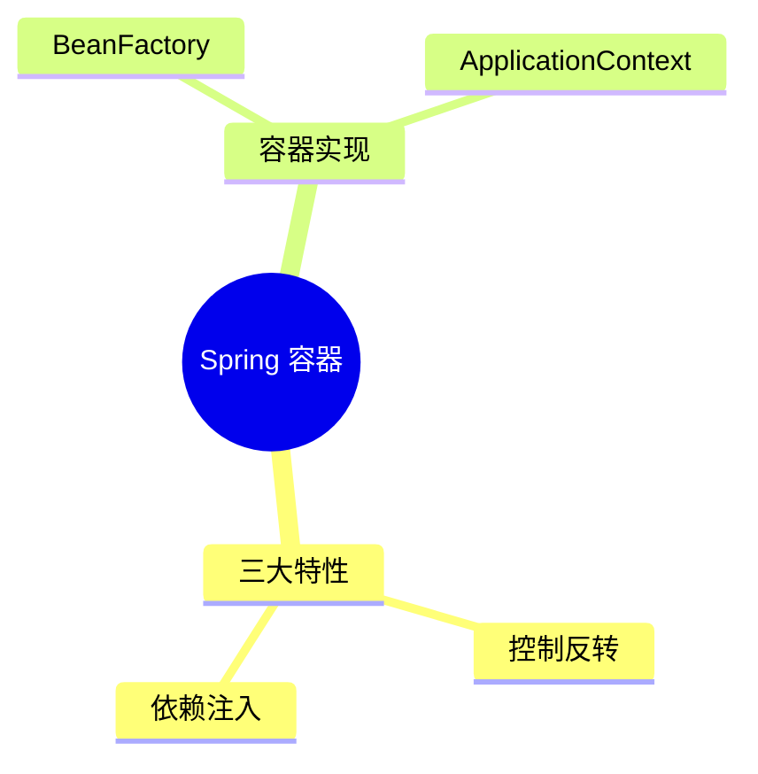
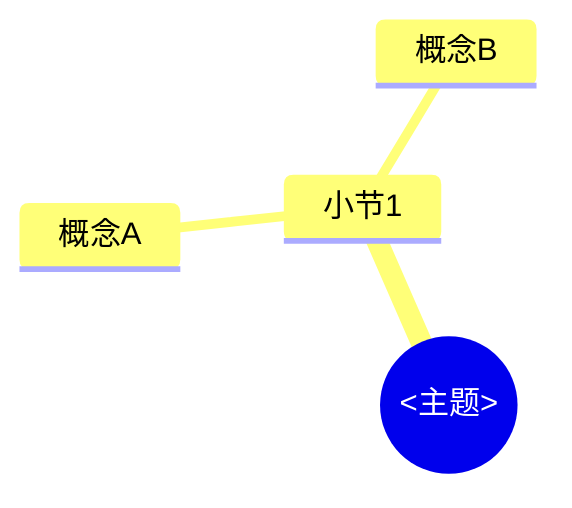

# 课堂笔记模板与规范（bilibili-douyin-notes）

**版本：v3**（笔记 frontmatter 的 `template_version` 字段取此值）

> **v1 / v2 冻结说明**：v1（★ 符号体系）与 v2（三词文字标签）自本版起冻结、不再演进，
> 但仍继续支持——质量门禁 `scripts/validate_note.py` 按笔记 frontmatter 的
> `template_version` 字段分派规则：写 `v3` 走本规范，写 `v2` 走三词标签规则，
> 缺失或写 `v1` 走旧 ★ 规则。既有 v1 / v2 笔记零改动继续可校验；
> **新笔记一律按本文件（v3）生成**：正文按技术知识体系组织、阅读连贯，
> 正文零时间戳、零考试向标签，视频时间戳只存在于文末折叠的“视频时间索引”。

本文件是本 skill 生成课堂笔记的**唯一模板与规范**，包含：完整 Markdown 骨架
（lecture / short 两型）、时间戳规范、语法契约（要点表达 / 概念卡片 / 自测题 /
知识地图 / 视频时间索引）、short 差异表、截图嵌入规范、生成流程、模板要点清单。
不依赖任何个人本机文件，任何人在任何机器上按本文件生成都应得到结构一致的笔记。

**定位（2026-10-04，v3）**：笔记是“看完课替代手写笔记”的**课后复习资料**——
读者通读正文即可完成复习，不需要拿笔记跳回视频。正文按技术知识体系组织、
阅读连贯；时间戳的唯一职责是文末时间索引里的“回看跳转”，深链由脚本补齐。

---

## 一、frontmatter（笔记第一个块，`---` 包围，全部字段必填）

```markdown
---
template_version: v3
note_type: lecture            # lecture（讲座/课程）| short（短视频）
platform: bilibili            # bilibili | douyin
bvid: BV1xxxxxxxxx            # 抖音平台此字段填 video_id
source: https://www.bilibili.com/video/BV1xxxxxxxxx
created: 2026-10-03
duration: "42:10"
---
```

- 字段与 v2 完全一致，仅 `template_version` 取 `v3`；
- `note_type` 取 metadata.json 顶层 `suggested_note_type`（由 bili_fetch.py /
  douyin_fetch.py 按总时长与分P数给出）；技术密度高的短片值得 lecture，Agent 可在
  frontmatter 覆盖建议值，门禁只读 frontmatter；
- `duration` 是带引号的 `"mm:ss"` 字符串（frontmatter 里唯一允许出现时刻的字段）；
- `source` 为原视频链接（B站含 BV 号；抖音为视频页链接）。

## 二、重点的表达方式（正文无标签、无时刻）

v3 废除 v2 的三词标签体系（核心必考 / 重点掌握 / 了解即可）及 ★ 符号——
重点层级不再靠标签前置声明，而靠**行文本身**承载：

- 要点用**普通无序列表** `- 要点句`，一条一个完整可复述的句子（不是关键词罗列）；
- 关键术语用 `**加粗**` 突出，读者扫加粗词即可抓住本节重点；
- **禁止**三词标签前缀（`**核心必考**`、`**重点掌握**`、`**了解即可**` 及
  `**必考**` 等任何变体，含 ★ 符号）——正文残留标签即 error；
- **禁止**行内 `[mm:ss]` 时刻（见第三节）；
- 每小节 ≥3 行实质内容；对比性内容（如两个容器的差异）优先用表格呈现。

```markdown
- **控制反转**把对象的创建权交给容器，**依赖注入**是它的实现手段
- BeanFactory 惰性实例化，ApplicationContext 默认预实例化单例
- 需要 fail-fast 的场景选 ApplicationContext，配置错误在启动阶段暴露
```

## 三、时间戳规范（正文零时刻）

**正文（frontmatter 之后、文末“视频时间索引”节之前）任何位置出现时刻即 error**。
禁令清单：

1. 目录条目（`- [N. 小节名](#锚点)`，不带时刻）；
2. 小节标题（`## N. 小节名`，禁止 `（08:12）` 式时刻后缀）；
3. 要点行与正文段落（禁行内 `[mm:ss]`）；
4. 代码块内部（含来源标注注释）；
5. 概念卡片全部字段（“出现”只写小节序号，如 `出现：2、5`）；
6. 自测题题干与答案；
7. 截图 caption（alt 文本）。

**唯一例外**是文末“视频时间索引”节（见 5.4）；frontmatter 的 `duration`
字段属元数据，不在此限。

时间索引条目的**防虚构规则**（沿用 v2）：

- 时刻必须来自**转写稿/字幕里真实存在的 `[mm:ss]` 时间行**，禁止编造；生成笔记前
  先在转写稿里确认该时间行存在（grep 即可）。转写稿时间是“该段话开始的时刻”，
  ASR 相对画面约有 1~3 秒滞后，**引用时允许小幅前移**——门禁按总秒数做 ±5 秒
  容差校验（可跨分钟，`[08:02]` 与转写稿 `[07:59]` 判近）；
- 分钟位允许 1~3 位（`[123:45]` 合法，容忍超长讲座）。

代码块来源标注（v3 起为**可选**，来源缺失不再 warning）：

- 来自克隆的代码仓库：`# 来源：仓库 <子项目>/<文件路径>`（注释符随语言，如
  Python 用 `#`、XML 用 `<!-- -->`）；
- 按视频讲解组织的代码：可写 `# 按视频讲解还原`，也可不写；
- 语言 fence 规范不变（java/python/js/ts/c/cpp/xml/sql/properties/yaml/json/
  bash/shell/html/css 等真实语言）；`mermaid`、`text`、`console`、`output`、
  `diff` 等非代码块不适用来源标注（但仍须正确闭合 fence）；
- **任何代码块内禁止出现时刻**（v2 的 `来源：P06 [12:34]` 写法废除）。

其余沿用 v2：转写稿/字幕里没有的内容不要编造；确有必要补充时标注
“（视频中未展开，建议补充）”。

## 四、完整骨架（lecture 型）

````markdown
---
template_version: v3
note_type: lecture
platform: bilibili            # bilibili | douyin
bvid: BV1xxxxxxxxx            # 抖音则为 video_id
source: https://www.bilibili.com/video/BV1xxxxxxxxx
created: 2026-10-03
duration: "42:10"
---

# 课堂笔记 03：Spring 容器与 Bean 生命周期

> 核心主线：从“为什么需要容器”出发，沿控制反转 → 依赖注入 → BeanFactory → ApplicationContext 的脉络，理解 Spring 如何接管对象的一生。
> 课程来源：<视频标题>（B站 BV1xxxxxxxxx，UP主：<名字>，共 17 个小节约 42 分钟）
> 课程代码：<简介中的仓库地址，如有>

## 目录

- [1. Spring 三大特性](#1-spring-三大特性)
- [2. BeanFactory 与 ApplicationContext](#2-beanfactory-与-applicationcontext)
- [本讲知识地图](#本讲知识地图)
- [概念卡片](#概念卡片)
- [自测题（复习用）](#自测题复习用)
- [视频时间索引](#视频时间索引)

---

## 1. Spring 三大特性

**核心思想：** 控制反转与依赖注入是同一件事的两种说法。

- **控制反转**把对象的创建权交给容器，**依赖注入**是它的实现手段
- 对象不再自己 `new` 依赖，而是由容器在装配阶段注入，耦合从编译期移到配置期
- 三大特性中真正改变编码习惯的是控制反转，其余特性服务于它的落地

```java
// 来源：仓库 spring-demo/src/main/java/demo/OrderService.java
@Service
public class OrderService {
    private final PaymentGateway gateway;

    public OrderService(PaymentGateway gateway) {  // 构造器注入
        this.gateway = gateway;
    }
}
```


---

## 2. BeanFactory 与 ApplicationContext

**核心思想：** 两者是同一继承体系的不同完成度。

- 两者都实现 **BeanFactory** 接口，**ApplicationContext** 是它的超集
- BeanFactory 惰性实例化，ApplicationContext 默认**预实例化全部单例**
- 需要启动即失败（fail-fast）的场景选 ApplicationContext，配置错误在启动阶段暴露

| 对比项 | BeanFactory | ApplicationContext |
|---|---|---|
| 实例化时机 | 惰性（首次 getBean 时） | 启动时预实例化单例 |
| 定位 | 基础容器 | 完整容器（事件、国际化、AOP 集成） |

---

## 本讲知识地图



## 概念卡片

### 控制反转

- 定义：把对象创建与依赖装配的控制权从代码转移到容器
- 出现：1、2
- 依赖：
- 易混：依赖注入——前者是设计原则，后者是落地手段

### ApplicationContext

- 定义：BeanFactory 的完整实现，启动即预实例化全部单例
- 出现：1、2
- 依赖：BeanFactory
- 易混：BeanFactory——预实例化 vs 惰性加载

## 自测题（复习用）

1. 在需要启动即失败（fail-fast）的场景下，为什么选 ApplicationContext 而不是 BeanFactory？（对应：ApplicationContext）
<details><summary>答案</summary>

**答案：** ApplicationContext 在启动时预实例化全部单例，配置错误会在启动阶段暴露；BeanFactory 惰性加载，错误推迟到首次获取时。

</details>

2. 解释控制反转与依赖注入的关系，并说明为什么说它们是同一件事的两种说法。（对应：控制反转）
<details><summary>答案</summary>

**答案：** 控制反转是设计原则（把控制权交给容器），依赖注入是它的实现手段（构造器/字段/Setter 注入）。

</details>

3. …（lecture 共 4~7 道）

---

<!-- NAV:BEGIN 由 scripts/note_nav.py 生成，请勿手工编辑 -->
## 视频时间索引

<details>
<summary>📺 需要回看原片时展开</summary>

- [00:00] 1. Spring 三大特性
- [08:12] 2. BeanFactory 与 ApplicationContext

</details>

<!-- NAV:END -->
````

骨架要点：

- `# 课堂笔记 <序号>：<主题>` 之下的引语块固定两行起：`> 核心主线：…`（一句话串起
  全片知识主线）+ `> 课程来源：…`；有代码仓库时再加 `> 课程代码：…`；
- 目录条目 `- [N. 小节名](#锚点)` 不带时刻，末尾固定列出 本讲知识地图 /
  概念卡片 / 自测题（复习用）/ 视频时间索引；
- 每个 `##` 小节标题不带时刻，至少 3 行实质内容，且以 `**核心思想：** <一句话>` 开头；
- 概念对比优先用表格（如 BeanFactory vs ApplicationContext）。

## 五、语法契约（精确、可解析）

### 5.1 概念卡片

```markdown
### <概念名>

- 定义：<一句话；必须非空>
- 出现：<小节序号>、<小节序号>（如 `出现：2、5`）
- 依赖：<概念名，逗号分隔；可为空>
- 易混：<概念名>——<一句话区别；可为空>
```

- 标题：`### ` + 非空概念名，**禁止** v2 式全角括号标签后缀
  （`### 控制反转（核心必考）` 非法）；
- `定义` 与 `出现` **必须存在且非空**（error）；
- `出现` **至少 2 个小节序号**（不足为 warning：单节概念不必单独成卡，考虑并入
  小节）；小节序号必须真实存在于笔记的 `##` 小节（error）；**“出现”里禁止时刻**
  （error）；
- `依赖` / `易混` 可空；非空时引用的概念名应在概念卡片集合内（warning）。

### 5.2 知识地图（mermaid）与节点标签卫生



- fence 语言必须是 `mermaid`，首个非空行匹配 `mindmap`（或 `graph` / `flowchart`）；
  `mindmap` 时至少 2 级缩进；
- **节点标签卫生**：单个标签 ≤ 12 字；标签内禁止 `(` `)` `[` `]` `{` `}` `"`；
  需要括号时用全角（）。

### 5.3 自测题

```markdown
1. <题干>？（对应：<概念名>）
<details><summary>答案</summary>

**答案：** <答案正文，至多一行>

</details>
```

- 每题紧随一个 `<details>` 折叠块（缺失为 error）；折叠内必须有以 `**答案：**`
  开头的行（缺失为 error）——`<details>` 在纯文本编辑器/终端里不可见，
  `**答案：**` 前缀保证不渲染时答案依然可读；
- **答案正文至多一行**（warning；避免答案变成第二篇笔记），且**禁止含时刻**（error）；
- `（对应：X）` 的 X 必须存在于**概念卡片集合**（lecture 缺失为 error；short 可选）；
- 数量：lecture **4~7** 道，short 2~3 道（越界 error）；
- 选题主打**高频原理与面试易错点**，禁止 yes/no 题干（“是否…”、“…吗？”；warning）。

### 5.4 视频时间索引（全文唯一允许时刻的区域，文末最后一节）

```markdown
---

<!-- NAV:BEGIN 由 scripts/note_nav.py 生成，请勿手工编辑 -->
## 视频时间索引

<details>
<summary>📺 需要回看原片时展开</summary>

- [00:00] 1. 为什么需要 Elasticsearch
- [00:31] 2. 倒排索引：ES 快的核心

</details>

<!-- NAV:END -->
```

- 位置与形态：全文最后一节，前接 `---` 分隔线，`<details>` 折叠包裹
  （默认收起，不打断正文阅读）；**`## 视频时间索引` 标题行必须位于
  `NAV:BEGIN` 与 `NAV:END` 标记对之内**（门禁 V3-E2 按此校验布局，
  与 v2 的"参考时间戳"布局一致）；
- **模型只写条目** `- [mm:ss] <与正文一级小节同名>`：一级章节（`## N. 小节名`）
  粒度一条，不做逐要点条目；条目标题与对应小节标题完全一致（含序号）；
- 时刻规则见第三节（转写稿真实时间行，±5s 容差，禁止虚构）；
- **模型不写 URL**：深链由 `scripts/note_nav.py` 填充为 `- [mm:ss](URL) 标题`
  （B站生成 `?p=N&t=S` 深链；抖音无深链，脚本保持纯文本）；
- note_type=lecture **必须有本节**（缺失 error）；short 可整体省略
  （**省略时 NAV 标记也不留**）；
- 标记规则：条目由模型首次写出，脚本只对标记内的条目行**原位填链**（幂等，
  标题行与 `<details>` 结构等非条目行原样保留）；标记缺失时脚本 warning 跳过
  （v3 不再向文末自动追加）；标记不配对 → 脚本报错退出且不改文件。

## 六、short 型差异表

与 lecture 的骨架相同，差异仅下表四处：

| 项 | lecture | short |
|---|---|---|
| 概念卡片 | 必须（≥2 张） | 不要求，出现则 ≤3 张 |
| 本讲知识地图 | 必须（mermaid） | **可省** |
| 自测题 | 4~7 道，每题必须带 `（对应：…）` | 2~3 道，`（对应：…）` 可选 |
| 视频时间索引 | **必须有**（文末折叠，note_nav 填深链） | 可整体省略（省略时 NAV 标记也不留；note_nav 跳过 short） |

## 七、截图嵌入规范

- 用相对路径嵌入对应小节：``；
- **截图嵌在相关要点或所属小节附近**（跟随它佐证的内容，方便对照阅读）；
- **caption（alt 文本）以锚点关键词开头**，门禁按 images/manifest.json 的
  `keyword` 字段交叉校验（warning）；caption 属于正文，**禁止含时刻**；
- 截图文件名**默认可中文**；需要 ASCII 文件名时给 `bili_screenshot.py` 加
  `--ascii-names`（中文锚点 label 自动转为 `zh-<md5前6位>`）；
- 脚本画质 QC 未通过的帧（`dark`/`bright`/`blurry`）由 Agent 视觉复核后决定是否采用。

## 八、生成流程（谁在什么时候调用什么）

```
1. bili_fetch.py <URL> <outdir>            → metadata.json（含 suggested_note_type）+ 字幕 txt
   └ 若 api_empty 且无 SESSDATA → 提示填 SESSDATA 后重跑；仍失败走 2
   （抖音：douyin_fetch.py <链接或口令> <outdir> → metadata.json + media_p01.mp4）
2. bili_transcribe.py <metadata.json>      → 缺字幕分P的 txt（抖音必走本步 ASR）
3. bili_screenshot.py <meta> <txt>    → images/*.png + images/manifest.json（含 keyword）
4. Agent 读 SKILL.md + 本模板，按第四节骨架写出笔记
   ├ 要点行、概念卡片、mermaid、自测题、时间索引条目 ← Agent 直接写出（条目不含 URL）
   └ NAV 标记对随骨架写出，标记内部内容交给第 5 步脚本填充
5. python scripts/note_nav.py <笔记.md> --meta <metadata.json> --txt-dir <txt目录>
                                          → 幂等填充 NAV 区块深链（模型永不生成 URL）
   └ v3 笔记默认执行；note_type=short → 跳过；NAV 标记缺失 → warning 跳过
6. python scripts/validate_note.py <笔记.md> --meta <metadata.json> --txt-dir <txt目录>
                                          → errors 必须为 0 才交付
```

**关键分工**：第 4 步的模型输出**不含任何 URL**（时间索引条目为纯文本
`- [mm:ss] 标题`）；第 5 步的脚本输出**不含任何自由文本**（把条目补成
`- [mm:ss](URL) 标题`）。两者在文件内通过 `NAV:BEGIN/END` 标记拼接，职责不重叠。

## 九、模板要点清单（生成笔记时逐条核对）

- [ ] 文件开头有 frontmatter（`---` 包围），且含 `template_version: v3`、`note_type`、
      `platform`、`bvid`（或 `video_id`）、`source`、`created`、`duration` 全部字段；
- [ ] `# 课堂笔记 <序号>：<主题>` + 引语块 `> 核心主线：…` / `> 课程来源：…`
      （有代码仓库再加 `> 课程代码：…`）；
- [ ] 目录条目 `- [N. 小节名](#锚点)` 不带时刻，末尾固定列出 本讲知识地图 /
      概念卡片 / 自测题（复习用）/ 视频时间索引；
- [ ] 小节标题 `## N. 小节名` 不带时刻后缀；每节以 `**核心思想：**` 一句话开头，
      除 `目录`/`视频时间索引` 外每节 ≥3 行实质内容；
- [ ] 要点用普通列表 `- 要点句`，关键术语 `**加粗**`；无三词标签前缀（残留 error）、
      无行内 `[mm:ss]`；对比性内容优先用表格；
- [ ] 代码块用课程真实代码 + 真实语言 fence；来源标注可选（`# 来源：仓库 <子项目>/<文件路径>`
      或 `# 按视频讲解还原`），任何代码块内禁时刻；
- [ ] 全文时刻只出现在文末“视频时间索引”（frontmatter `duration` 除外）；索引条目
      `- [mm:ss] <与正文一级小节同名>`，时刻来自转写稿真实时间行（±5s 容差，
      禁止虚构），lecture 必须有本节；
- [ ] 概念卡片：`### 概念名`（无标签后缀）+ 定义/出现（≥2 小节序号、禁时刻）/
      依赖/易混；
- [ ] 自测题：lecture 4~7 道（short 2~3 道），每题 `（对应：概念名）`（概念必须存在
      于概念卡片集合）+ `<details>` 折叠 + `**答案：**` 开头、至多一行、禁时刻；
      禁 yes/no 题干；
- [ ] 知识地图用 ` ```mermaid mindmap `；节点标签禁半角括号与引号，≤12 字
      （需要括号用全角）；
- [ ] 截图嵌在相关要点/所属小节附近；caption 以锚点关键词开头、不含时刻；截图文件名
      默认可中文，需要 ASCII 时给 `bili_screenshot.py` 加 `--ascii-names`；
- [ ] 生成后先跑 `python scripts/note_nav.py <笔记.md> --meta <metadata.json>
      --txt-dir <转写稿目录>`（v3 默认执行，short 跳过），再运行
      `python scripts/validate_note.py <笔记.md> --meta <metadata.json>
      --txt-dir <转写稿目录>`，errors 为 0 才交付。

---

## 附：v1 / v2 冻结差异速查

（细节以 git 历史为准）

| 项 | v1（冻结） | v2（冻结） | v3（现行） |
|---|---|---|---|
| 重点分级 | ★ / ★★ / ★★★ 符号 | 三词标签（核心必考/重点掌握/了解即可） | 无标签，要点句 + 术语加粗 |
| 时间戳 | 行内 `[mm:ss]` 常见 | 行内可选、默认少用 | 正文禁用，仅文末“视频时间索引” |
| 概念卡片标题 | — | `概念名（标签词）` | `概念名`（无标签后缀） |
| 自测题数量 | — | lecture 5~9 / short 2~3 | lecture 4~7 / short 2~3 |
| 时间导航 | — | “参考时间戳”可选、默认不做 | “视频时间索引” lecture 必有，折叠于文末，note_nav v3 默认填深链 |
